# Cryptography 101
## A Basic Introduction to Security Fundamentals

<div class="pt-12">
  <span @click="$slidev.nav.next" class="px-2 py-1 rounded cursor-pointer" hover="bg-white bg-opacity-10">
    Press Space for next page <carbon:arrow-right class="inline"/>
  </span>
</div>

---
layout: default
---

# What is Cryptography?

Cryptography is the practice and study of techniques for secure communication in the presence of adversaries.

**Key Goals:**
- **Confidentiality**: Ensuring information is accessible only to authorized parties
- **Integrity**: Guaranteeing data hasn't been altered
- **Authentication**: Verifying the identity of parties
- **Non-repudiation**: Preventing denial of actions taken

---
layout: two-cols
---

# Basic Concepts

::left::

**Plaintext**
- Original readable message
- Before encryption

**Ciphertext**
- Encrypted message
- Unreadable without key

::right::

**Key**
- Secret information used in encryption/decryption
- Different types for different systems

**Algorithm**
- Mathematical procedure for encryption/decryption
- Should be publicly known (Kerckhoffs's principle)

---
layout: center
---

# Hashing
## One-Way Functions

---

# What is Hashing?

A hash function takes an input and produces a **fixed-size** output (hash/digest).

**Properties:**
- ✅ **Deterministic**: Same input always produces same output
- ✅ **Fast to compute**: Efficient calculation
- ✅ **One-way**: Cannot reverse the hash to get original input
- ✅ **Avalanche effect**: Small input change = completely different hash
- ✅ **Collision resistant**: Hard to find two inputs with same hash

**Common Uses:**
- Password storage
- Data integrity verification
- Digital signatures
- Blockchain

---

# Hashing Process

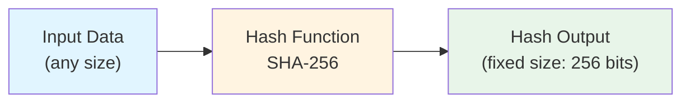

**Example:**
```
Input:  "Hello, World!"
SHA-256: a591a6d40bf420404a011733cfb7b190d62c65bf0bcda32b57b277d9ad9f146e

Input:  "Hello, World"  (removed !)
SHA-256: dffd6021bb2bd5b0af676290809ec3a53191dd81c7f70a4b28688a362182986f
```

---

# Popular Hash Functions

| Algorithm | Output Size | Status | Use Cases |
|-----------|-------------|--------|-----------|
| **MD5** | 128 bits | ⚠️ Broken | Legacy systems (avoid) |
| **SHA-1** | 160 bits | ⚠️ Deprecated | Git commits (transitioning) |
| **SHA-256** | 256 bits | ✅ Secure | Bitcoin, certificates, general use |
| **SHA-3** | Variable | ✅ Secure | Modern applications |
| **bcrypt** | 184 bits | ✅ Secure | Password hashing |
| **Argon2** | Variable | ✅ Secure | Password hashing (latest) |

---
layout: center
---

# Symmetric Cryptography
## Same Key for Encryption & Decryption

---

# Symmetric Encryption

Both parties use the **same secret key** to encrypt and decrypt messages.

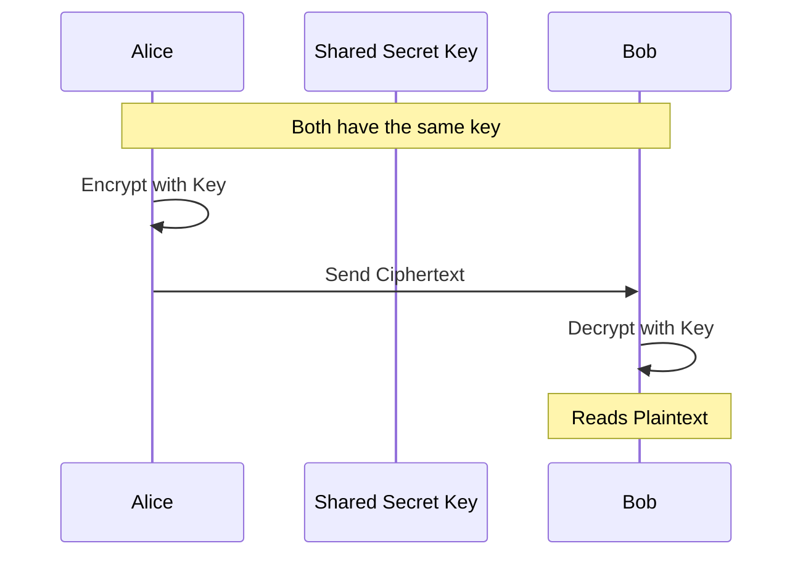

**Advantages:**
- ⚡ Fast and efficient
- 💪 Strong security with proper key length

**Challenges:**
- 🔑 Key distribution problem
- 🔢 Many keys needed (n×(n-1)/2 for n users)

---

# Symmetric Encryption Process

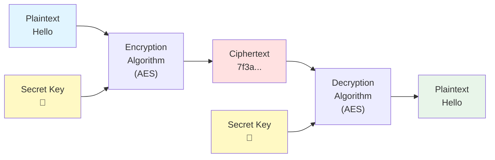

---

# Common Symmetric Algorithms

| Algorithm | Key Size | Block Size | Status |
|-----------|----------|------------|--------|
| **DES** | 56 bits | 64 bits | ❌ Insecure |
| **3DES** | 168 bits | 64 bits | ⚠️ Deprecated |
| **AES-128** | 128 bits | 128 bits | ✅ Secure |
| **AES-256** | 256 bits | 128 bits | ✅ Highly Secure |
| **ChaCha20** | 256 bits | Stream | ✅ Modern |

**AES** (Advanced Encryption Standard) is the most widely used today:
- Government approved
- Hardware acceleration available
- Used in HTTPS, VPNs, disk encryption

---
layout: center
---

# Asymmetric Cryptography
## Public Key Cryptography

---

# Asymmetric Encryption

Uses a **pair of keys**: public key (shareable) and private key (secret).

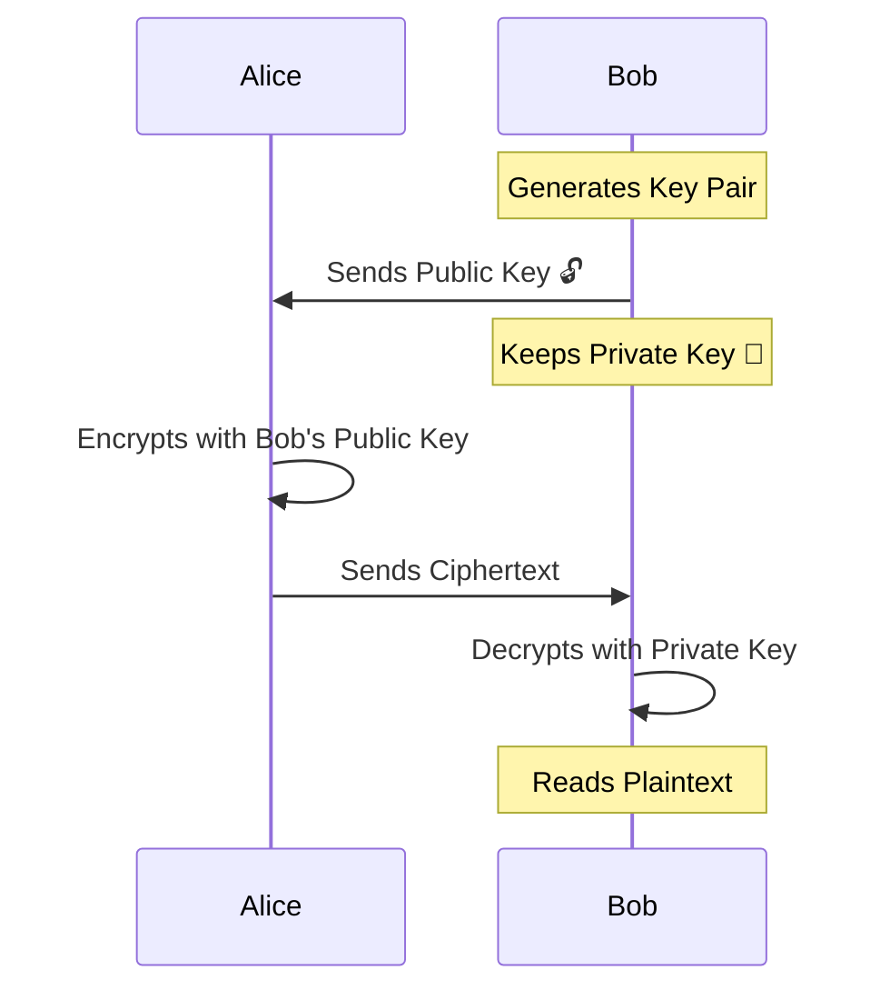

**Key Properties:**
- 🔓 Public key can be shared freely
- 🔑 Private key must remain secret
- 🔐 What's encrypted with public key can only be decrypted with private key

---

# Asymmetric Encryption Process

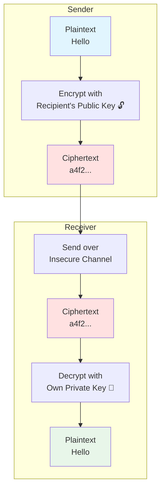

---

# Asymmetric vs Symmetric

| Feature | Symmetric | Asymmetric |
|---------|-----------|------------|
| **Keys** | One shared key | Key pair (public + private) |
| **Speed** | ⚡ Very fast | 🐢 Slower (100-1000x) |
| **Key Distribution** | ⚠️ Difficult | ✅ Easy (public key) |
| **Key Management** | Many keys for many users | One key pair per user |
| **Use Cases** | Bulk data encryption | Key exchange, signatures |

**Hybrid Approach (SSL/TLS):**
1. Use asymmetric crypto to exchange a symmetric key
2. Use symmetric crypto for actual data encryption
3. Get best of both worlds! 🎯

---

# Common Asymmetric Algorithms

| Algorithm | Key Size | Based On | Use Cases |
|-----------|----------|----------|-----------|
| **RSA** | 2048-4096 bits | Factorization | Encryption, signatures |
| **DSA** | 2048-3072 bits | Discrete log | Digital signatures |
| **ECC** | 256-521 bits | Elliptic curves | Modern systems |
| **Diffie-Hellman** | 2048+ bits | Discrete log | Key exchange |
| **Ed25519** | 256 bits | Edwards curve | SSH keys, signing |

**Note:** ECC provides equivalent security with much smaller keys (256-bit ECC ≈ 3072-bit RSA)

---
layout: center
---

# Digital Signatures
## Authentication & Integrity

---

# What are Digital Signatures?

Digital signatures prove:
- ✍️ **Authentication**: Who created the message
- 🔒 **Integrity**: Message hasn't been modified
- 🚫 **Non-repudiation**: Sender can't deny sending it

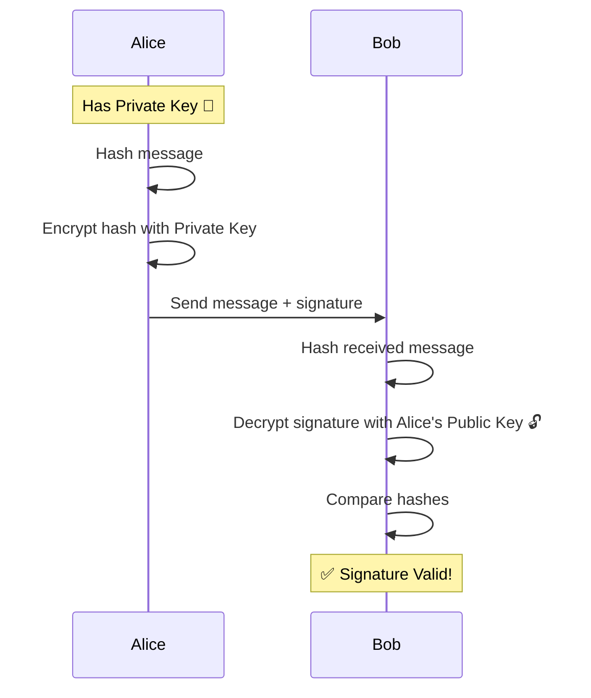

---

# Digital Signature Process

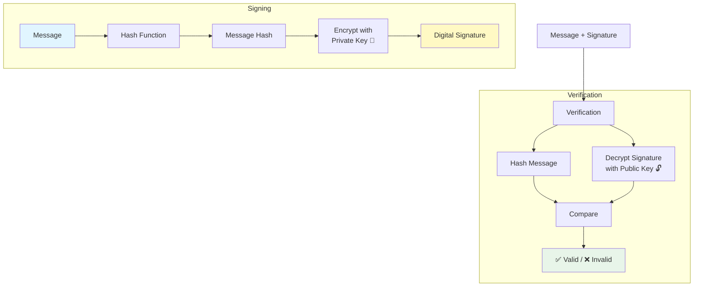

---

# Signature vs Encryption

**Common Confusion:**

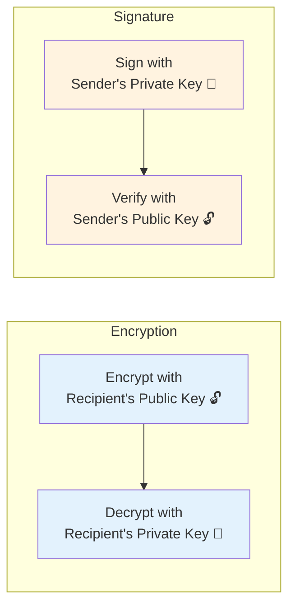

**Remember:**
- **Encryption**: Private to decrypt (confidentiality)
- **Signature**: Private to sign (authentication)

---
layout: center
---

# Key Exchange
## Securely Sharing Secret Keys

---

# The Key Exchange Problem

How can two parties establish a shared secret over an insecure channel?

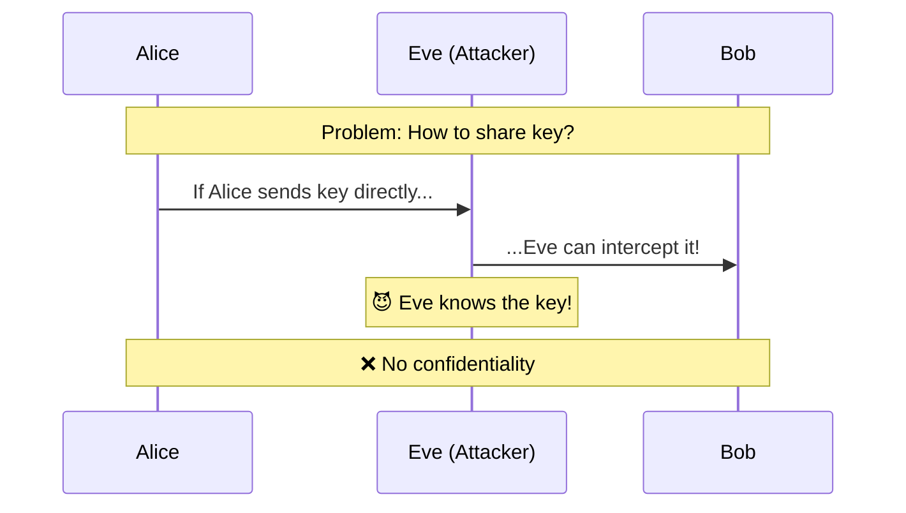

**Solutions:**
- Diffie-Hellman key exchange
- RSA key transport
- Modern: ECDH (Elliptic Curve Diffie-Hellman)

---

# Diffie-Hellman Key Exchange

Allows two parties to establish a shared secret without ever transmitting it!

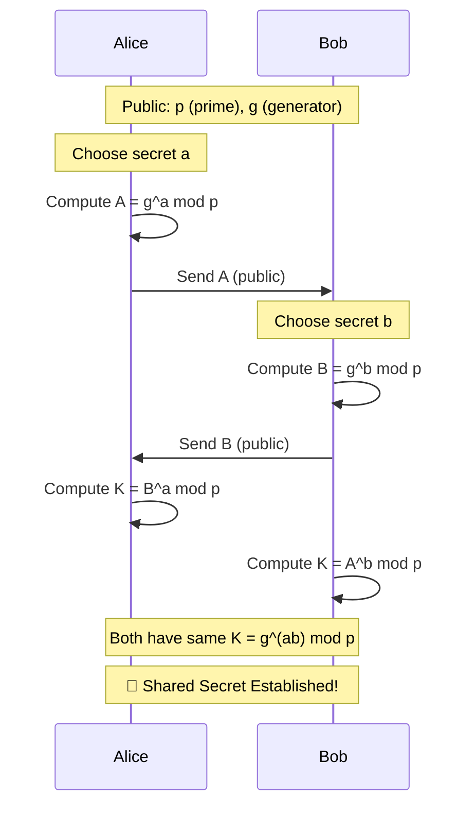

**Security:** Even if Eve sees A and B, she can't compute K without knowing a or b (discrete logarithm problem).

---
layout: center
---

# Certificates & PKI
## Public Key Infrastructure

---

# Digital Certificates

A certificate binds a public key to an identity.

**Certificate Contains:**
- Subject's name (domain, organization)
- Subject's public key
- Issuer (Certificate Authority)
- Validity period
- Digital signature from CA

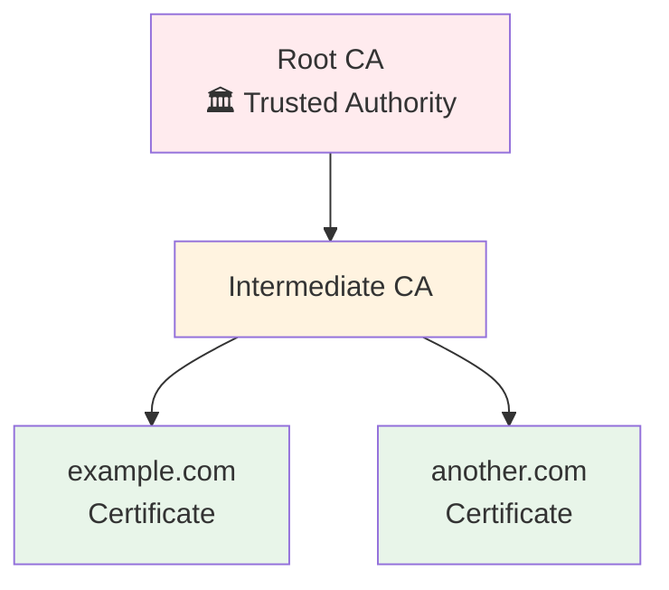

---

# How HTTPS Works

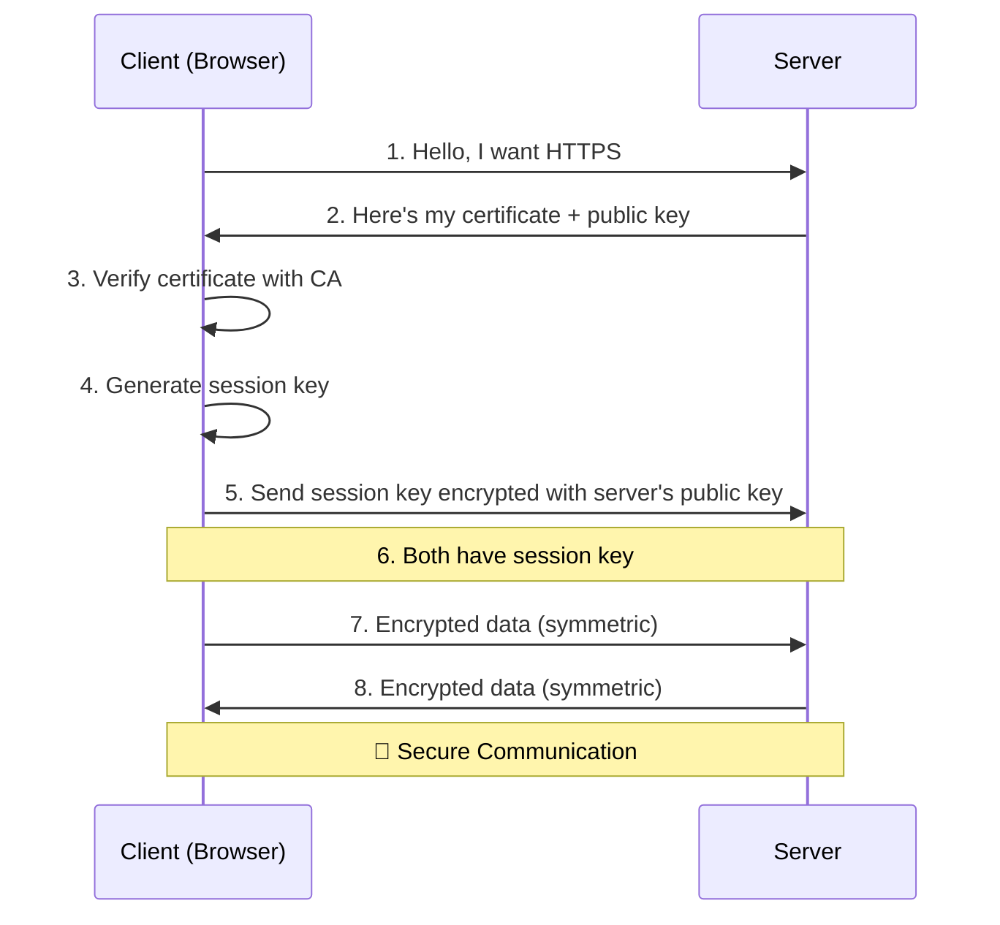

**Key Points:**
- Asymmetric crypto for initial handshake
- Symmetric crypto for actual data transfer
- Certificate provides authentication

---
layout: center
---

# Best Practices
## Staying Secure

---

# Cryptography Best Practices

**DO:**
- ✅ Use well-established algorithms (AES, RSA, SHA-256)
- ✅ Use adequate key lengths (RSA ≥ 2048, AES ≥ 128)
- ✅ Use trusted libraries (OpenSSL, libsodium)
- ✅ Keep software updated
- ✅ Use authenticated encryption (AES-GCM)
- ✅ Generate truly random keys

**DON'T:**
- ❌ Roll your own crypto
- ❌ Use deprecated algorithms (MD5, DES, RC4)
- ❌ Reuse keys across different purposes
- ❌ Store keys in code or version control
- ❌ Use weak passwords
- ❌ Ignore warnings about certificates

---
layout: center
---

# Summary

---

# Key Takeaways

| Concept | Purpose | Example |
|---------|---------|---------|
| **Hashing** | Integrity, one-way | SHA-256 for passwords |
| **Symmetric** | Fast bulk encryption | AES for file encryption |
| **Asymmetric** | Key exchange, authentication | RSA for TLS handshake |
| **Signatures** | Authentication, non-repudiation | Sign software releases |
| **Certificates** | Identity verification | HTTPS websites |

**Remember:**
- Different tools for different jobs
- Security is a process, not a product
- Stay updated with current best practices
- When in doubt, use established libraries

---
layout: end
---

# Thank You!
## Questions?

<div class="abs-br m-6 text-xl">
  <carbon:security class="inline"/> Cryptography 101
</div>
