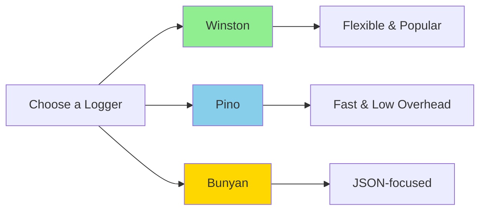
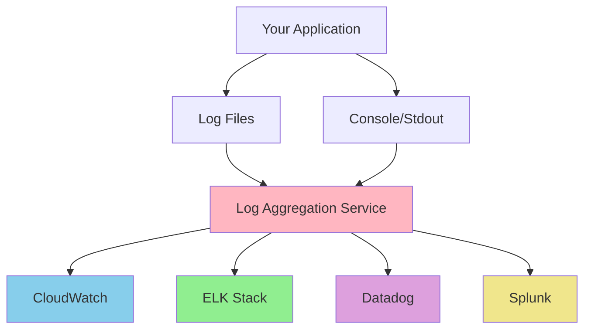

# Logging Best Practices
## Building Observable NodeJS Applications

Backend & Frontend Logging with TypeScript

---
layout: center
---

# Why Logging Matters

- **Debugging**: Understand what went wrong in production
- **Monitoring**: Track application health and performance
- **Auditing**: Record important business events
- **Troubleshooting**: Diagnose issues without reproduction
- **Security**: Detect and investigate security incidents

<!-- 
Logging is your window into production. Unlike development where you can attach a debugger,
production requires strategic logging to understand application behavior.
-->

---

# Log Levels Hierarchy

```typescript
FATAL   // Application cannot continue (database down, critical service unavailable)
ERROR   // Something failed, needs immediate attention
WARN    // Unexpected but handled (deprecated API, fallback used)
INFO    // Important business events (user login, order placed)
DEBUG   // Detailed information for debugging
TRACE   // Very detailed diagnostic information
```

**Rule of thumb**: Production should run at INFO level, development at DEBUG

<!-- 
Each level serves a purpose. Too much logging (DEBUG in prod) drowns signal in noise.
Too little (ERROR only) means you miss important context when things go wrong.
-->

---
layout: two-cols
---

# Unstructured Logging

```javascript
console.log('User logged in');
console.log('User: ' + userId + ' logged in');
console.error('Failed to save order');
```

❌ Hard to parse
❌ Difficult to search
❌ No context
❌ Poor for automation

::right::

# Structured Logging

```javascript
logger.info('User logged in', {
  userId: '12345',
  email: 'user@example.com',
  timestamp: new Date().toISOString()
});

logger.error('Failed to save order', {
  orderId: 'ORD-789',
  error: err.message,
  userId: '12345'
});
```

✅ Machine readable
✅ Easy to query
✅ Rich context
✅ Aggregation-friendly

---

# Backend: Request Logging Middleware

```typescript
// Basic request logger
app.use((req: Request, res: Response, next: NextFunction) => {
  const start = Date.now();
  
  res.on('finish', () => {
    const duration = Date.now() - start;
    logger.info('HTTP Request', {
      method: req.method,
      url: req.url,
      statusCode: res.statusCode,
      duration: `${duration}ms`,
      userAgent: req.get('user-agent')
    });
  });
  
  next();
});
```

**Captures**: Every HTTP request with timing and status

<!-- 
This middleware logs all requests after they complete. The 'finish' event ensures
we have the response status code. Duration helps identify slow endpoints.
-->

---

# Backend: Error Logging

```typescript
// Error handling middleware (must be last)
app.use((err: Error, req: Request, res: Response, next: NextFunction) => {
  logger.error('Unhandled error', {
    error: err.message,
    stack: err.stack,
    method: req.method,
    url: req.url,
    body: req.body, // Be careful with sensitive data!
    userId: req.user?.id
  });
  
  res.status(500).json({
    error: 'Internal server error',
    requestId: req.id // Never expose error details to client
  });
});
```

**Key**: Log full error server-side, return generic message to client

---

# Security: What NOT to Log

```typescript
// ❌ NEVER log these
logger.info('User login', {
  email: 'user@example.com',
  password: 'secret123',        // ❌ Passwords
  creditCard: '4532-1234-5678', // ❌ Payment info
  ssn: '123-45-6789'            // ❌ PII/sensitive data
});

// ✅ Log safely
logger.info('User login attempt', {
  email: 'user@example.com',
  success: true,
  ip: req.ip
});

logger.info('Payment processed', {
  orderId: 'ORD-123',
  amount: 99.99,
  last4: '5678'  // ✅ Only last 4 digits
});
```

---

# Security: Sanitizing Request Data

```typescript
function sanitizeBody(body: any): any {
  const sanitized = { ...body };
  const sensitiveFields = ['password', 'token', 'secret', 'apiKey', 'creditCard'];
  
  sensitiveFields.forEach(field => {
    if (sanitized[field]) {
      sanitized[field] = '[REDACTED]';
    }
  });
  
  return sanitized;
}

// Usage in middleware
logger.info('API request', {
  method: req.method,
  url: req.url,
  body: sanitizeBody(req.body)
});
```

---

# Frontend: Console Logging Levels

```typescript
// Use appropriate levels
console.debug('Rendering component with props:', props); // Development only
console.info('User navigated to:', window.location.pathname);
console.warn('API key missing, using default configuration');
console.error('Failed to fetch user data:', error);

// Group related logs
console.group('User Authentication');
console.log('Checking token validity');
console.log('Token expires:', expiryDate);
console.log('Refresh needed:', needsRefresh);
console.groupEnd();
```

**Remember**: Console logs appear in user's browser!

<!-- 
Unlike backend, frontend logs are visible to users. Be mindful of what you log.
Use console.group for organizing related logs during complex operations.
-->

---

# Frontend: Global Error Handling

```typescript
// Catch unhandled errors in the browser
window.addEventListener('error', (event: ErrorEvent) => {
  console.error('Unhandled error', {
    error: event.error?.message,
    stack: event.error?.stack,
    filename: event.filename,
    lineno: event.lineno,
    colno: event.colno,
    timestamp: new Date().toISOString()
  });
  
  // In production, send to a logging service
  if (process.env.NODE_ENV === 'production') {
    // logToService(event.error);
  }
});

// Catch unhandled promise rejections
window.addEventListener('unhandledrejection', (event: PromiseRejectionEvent) => {
  console.error('Unhandled promise rejection', {
    reason: event.reason,
    timestamp: new Date().toISOString()
  });
});
```

---

# Frontend: API Call Logging

```typescript
// axios interceptor for logging
axios.interceptors.request.use(
  config => {
    console.debug('API Request', {
      method: config.method,
      url: config.url,
      timestamp: new Date().toISOString()
    });
    return config;
  }
);

axios.interceptors.response.use(
  response => {
    console.debug('API Response', {
      status: response.status,
      url: response.config.url
    });
    return response;
  },
  error => {
    console.error('API Error', {
      status: error.response?.status,
      url: error.config?.url,
      message: error.message
    });
    return Promise.reject(error);
  }
);
```

---

# Environment-Specific Logging

```typescript
// Backend: config/logger.ts
const isDevelopment = process.env.NODE_ENV === 'development';

const loggerConfig = {
  level: isDevelopment ? 'debug' : 'info',
  format: isDevelopment ? 'pretty' : 'json',
  colorize: isDevelopment
};

// Frontend: utils/logger.ts
const shouldLog = (level: string): boolean => {
  if (process.env.NODE_ENV === 'production') {
    return ['error', 'warn'].includes(level);
  }
  return true; // Log everything in development
};

export const logger = {
  debug: (...args: any[]) => shouldLog('debug') && console.debug(...args),
  info: (...args: any[]) => shouldLog('info') && console.info(...args),
  error: (...args: any[]) => shouldLog('error') && console.error(...args)
};
```

---

# What to Log

```typescript
// ✅ DO log these events
- Application startup/shutdown
- User authentication events (login, logout, password reset)
- Business transactions (order placed, payment processed)
- External API calls and responses
- Database connection issues
- Configuration changes
- Critical errors and exceptions
- Performance metrics (slow queries, high memory)

// ❌ DON'T log
- Every function call (too noisy)
- Passwords, tokens, API keys
- Full credit card numbers or SSNs
- Temporary/intermediate values in loops
- Personal health information
```

---

# What NOT to Log

```typescript
// ❌ Too verbose - drowns out important logs
function processUser(user: User): string {
  logger.debug('Entering processUser'); // Unnecessary
  logger.debug('user object:', user);   // Too much detail
  
  const name = user.name;
  logger.debug('name is:', name);       // Obvious
  
  logger.debug('Exiting processUser'); // Unnecessary
  return name.toUpperCase();
}

// ✅ Log strategically
function processUser(user: User): string {
  if (!user.name) {
    logger.warn('User missing name field', { userId: user.id });
  }
  return user.name?.toUpperCase() || 'UNKNOWN';
}
```

---

# Log Message Best Practices

```typescript
// ❌ Poor messages
logger.error('Error');
logger.info('Success');
logger.debug(data); // Just dumping data

// ✅ Good messages - descriptive and searchable
logger.error('Failed to connect to database', {
  host: config.db.host,
  error: err.message,
  retryAttempt: 3
});

logger.info('User registered successfully', {
  userId: newUser.id,
  email: newUser.email
});
```

**Tip**: Use descriptive messages that are easy to search for in logs

---

# Recommended: Logging Libraries



**Recommendation for your project**: **Pino** or **Winston**
- Structured logging support
- Multiple transports (file, console, cloud)
- Performance optimized
- Production-ready

---

# Example: Setting Up Winston

```typescript
// logger.ts
import winston from 'winston';

const logger = winston.createLogger({
  level: process.env.LOG_LEVEL || 'info',
  format: winston.format.combine(
    winston.format.timestamp(),
    winston.format.errors({ stack: true }),
    winston.format.json()
  ),
  transports: [
    new winston.transports.File({ filename: 'error.log', level: 'error' }),
    new winston.transports.File({ filename: 'combined.log' })
  ]
});

// In development, also log to console with colors
if (process.env.NODE_ENV !== 'production') {
  logger.add(new winston.transports.Console({
    format: winston.format.simple()
  }));
}

export default logger;
```

---

# Log Rotation & Retention

**Problem**: Log files grow indefinitely, consuming disk space

**Solutions**:
- **Log rotation**: Create new files periodically (daily, weekly, by size)
- **Retention policy**: Delete old logs automatically
- **Compression**: Archive old logs to save space

```typescript
// Using winston-daily-rotate-file
import DailyRotateFile from 'winston-daily-rotate-file';

new DailyRotateFile({
  filename: 'application-%DATE%.log',
  datePattern: 'YYYY-MM-DD',
  maxSize: '20m',      // Rotate at 20MB
  maxFiles: '14d',     // Keep logs for 14 days
  compress: true       // Compress rotated files
});
```

---

# Production Logging Infrastructure



**Note**: These services collect, index, and visualize logs at scale

<!-- 
In production, logs typically go to specialized services that can handle
millions of log entries, provide search, alerting, and visualization.
-->

---
layout: center
---

# Key Takeaways

1. **Use log levels appropriately** - INFO for production, DEBUG for development
2. **Structure your logs** - JSON format with context
3. **Never log sensitive data** - Passwords, tokens, PII
4. **Log strategically** - Important events, not every function call
5. **Environment matters** - Different logging for dev vs production
6. **Use proper tools** - Winston or Pino for production applications

---

# Practical Exercise: Refactor Your Logs

**Goal**: Improve logging in your existing applications

**Steps**:
1. Review current logging practices
2. Identify security issues (leaked credentials?)
3. Add structured logging
4. Implement proper log levels
5. Add request/response middleware
6. Set up environment-specific configuration

**Instruction file**: `.github/instructions/logging.instructions.md`

Use Copilot to help refactor your logging following the guidelines!

---
layout: end
---

# Questions?

Let's build observable applications! 🚀
