# Password Storage in Databases

## From Naive to Secure

---

---
layout: default
---

# Why Does Password Storage Matter?

**The Challenge:**

- Users need to authenticate with passwords
- Systems must verify passwords
- Databases can be compromised

**The Stakes:**

- 🔴 Stolen credentials can affect multiple sites (password reuse)
- 🔴 Legal and regulatory compliance (GDPR, CCPA)
- 🔴 Company reputation and trust
- 🔴 Financial damages from breaches

---

---
layout: center
---

# Method 1: Plaintext Storage

## 🚫 Never Do This

---

# Plaintext Storage

**How it works:**
Store passwords exactly as users enter them.

```sql {all}{maxHeight:'400px'}
CREATE TABLE users (
  id INT PRIMARY KEY,
  username VARCHAR(50),
  password VARCHAR(100)  -- Stored as-is
);

INSERT INTO users VALUES (1, 'alice', 'MyPassword123');
INSERT INTO users VALUES (2, 'bob', 'SecretPass456');
```

**Login Check:**

```sql {all}{maxHeight:'400px'}
SELECT * FROM users
WHERE username = 'alice' AND password = 'MyPassword123';
```

---

# Plaintext Storage - Issues

**Critical Vulnerabilities:**

| Issue                  | Impact                                        |
| ---------------------- | --------------------------------------------- |
| 💥 **Database Breach** | All passwords immediately exposed             |
| 💥 **Insider Threat**  | DBAs and developers can see all passwords     |
| 💥 **Logs & Backups**  | Passwords visible in logs, backups, debugging |
| 💥 **No Protection**   | Zero security if database is compromised      |
| 💥 **Legal Risk**      | Violates data protection regulations          |

**Real-World Example:**

```text {all}{maxHeight:'400px'}
Database dump:
alice | MyPassword123
bob   | SecretPass456
carol | ilovecats2023
```

All passwords instantly readable! 😱

---

# Plaintext Storage - Attack Scenario


**Verdict:** ❌ **Completely Unacceptable**

---

---
layout: center
---

# Method 2: Simple Encryption

## 🔴 Still Not Good Enough

---

# Simple Encryption

**How it works:**
Encrypt passwords with a symmetric key before storing.

```javascript {all}{maxHeight:'400px'}
const crypto = require("crypto");

// Encryption
function encryptPassword(password, secretKey) {
  const cipher = crypto.createCipher("aes-256-cbc", secretKey);
  let encrypted = cipher.update(password, "utf8", "hex");
  encrypted += cipher.final("hex");
  return encrypted;
}

// Decryption
function decryptPassword(encrypted, secretKey) {
  const decipher = crypto.createDecipher("aes-256-cbc", secretKey);
  let decrypted = decipher.update(encrypted, "hex", "utf8");
  decrypted += decipher.final("utf8");
  return decrypted;
}
```

```sql {all}{maxHeight:'400px'}
INSERT INTO users VALUES (1, 'alice', 'a3f5b8c2e1d4...');
```

---

# Simple Encryption - Issues

**Problems:**

| Issue                          | Impact                                             |
| ------------------------------ | -------------------------------------------------- |
| 🔴 **Key Management**          | If encryption key is stolen, all passwords exposed |
| 🔴 **Reversible**              | Passwords can be decrypted back to plaintext       |
| 🔴 **Key in Code**             | Encryption key often hardcoded or in config        |
| 🔴 **Single Point of Failure** | One key protects everything                        |
| 🔴 **Insider Threat**          | Anyone with key access can decrypt all passwords   |

**Attack Scenario:**

```text {all}{maxHeight:'400px'}
Attacker finds encryption key in:
- Source code repository
- Configuration file
- Environment variables
- Memory dump

Result: All passwords can be decrypted!
```

**Verdict:** ❌ **Not Recommended for Passwords**

---

---
layout: center
---

# Method 3: Basic Hashing

## 🟡 Better, but Still Vulnerable

---

# Basic Hashing (Without Salt)

**How it works:**
Use a one-way hash function to store passwords.

```javascript {all}{maxHeight:'200px'}
const crypto = require("crypto");

function hashPassword(password) {
  return crypto.createHash("sha256").update(password).digest("hex");
}

// Storing
const passwordHash = hashPassword("MyPassword123");
// Result: ef92b778bafe771e89245b89ecbc08a44a4e166c06659911881f383d4473e94f
```

```sql {all}{maxHeight:'400px'}
CREATE TABLE users (
  id INT PRIMARY KEY,
  username VARCHAR(50),
  password_hash VARCHAR(64)
);

INSERT INTO users VALUES (
  1,
  'alice',
  'ef92b778bafe771e89245b89ecbc08a44a4e166c06659911881f383d4473e94f'
);
```

---

# Basic Hashing - How It Works

```mermaid {theme: 'neutral', scale: 0.6}
graph TD
    D[Hash Stored in Database]

    E["Login Attempt:<br/>'MyPassword123'"] --> F[SHA-256 Hash Function]
    F --> G["Hash:<br/>ef92b778bafe..."]
    G --> H{Compare Hashes}
    D --> H
    H -->|Match| I[✅ Login Success]
    H -->|No Match| J[❌ Login Failed]

    style E fill:#e1f5ff
    style F fill:#fff4e1
    style G fill:#e8f5e9
    style I fill:#c8e6c9
    style J fill:#ffcdd2
```



---

# Basic Hashing - Issues

**Vulnerabilities:**

| Issue                   | Description                                       |
| ----------------------- | ------------------------------------------------- |
| 🟡 **Rainbow Tables**   | Pre-computed tables of hash:password pairs        |
| 🟡 **Identical Hashes** | Same password = same hash across all users        |
| 🟡 **Common Passwords** | Attackers can quickly identify common passwords   |
| 🟡 **Fast Computation** | Modern GPUs can compute billions of hashes/second |
| 🟡 **No Uniqueness**    | No user-specific variation                        |

**Example Attack:**

```text {all}{maxHeight:'400px'}
Database contains:
alice  | ef92b778bafe771e89245b89ecbc08a44a4e166c06659911881f383d4473e94f
bob    | ef92b778bafe771e89245b89ecbc08a44a4e166c06659911881f383d4473e94f
carol  | 5e884898da28047151d0e56f8dc6292773603d0d6aabbdd62a11ef721d1542d8

👀 Alice and Bob have the same hash = same password!
🔍 Attacker checks rainbow table...
✓ ef92b778... = "MyPassword123"
```

---

# Rainbow Table Attack

**What are Rainbow Tables?**
Pre-computed tables that map hashes back to passwords.

**Sample Rainbow Table (SHA-256):**

```text {all}{maxHeight:'300px',lines:false}
Password      SHA-256 Hash
-----------   ----------------------------------------------------------------
password      5e884898da28047151d0e56f8dc6292773603d0d6aabbdd62a11ef721d1542d8
123456        8d969eef6ecad3c29a3a629280e686cf0c3f5d5a86aff3ca12020c923adc6c92
Password123   ef92b778bafe771e89245b89ecbc08a44a4e166c06659911881f383d4473e94f
qwerty        65e84be33532fb784c48129675f9eff3a682b27168c0ea744b2cf58ee02337c5
12345678      ef797c8118f02dfb649607dd5d3f8c7623048c9c063d532cc95c5ed7a898a64f
admin         8c6976e5b5410415bde908bd4dee15dfb167a9c873fc4bb8a81f6f2ab448a918
letmein       1c8bfe8f801d79745c4631d09fff36c82aa37fc4cce4fc946683d7b336b63032
welcome       b2aa58a3c8807bb40c1d0da5e1df234143c3fed5abe6e8e4bf599ebfc2a36f37
```

**How it works:**

1. Attacker steals hash from database: `ef92b778bafe...`
2. Looks up hash in rainbow table
3. Finds match: `Password123`
4. Can now login as that user!

**Performance:**

- Modern GPUs: ~100 billion SHA-256 hashes per second
- Common password dictionaries: millions of passwords
- Result: Quick cracking of unsalted hashes

**Verdict:** 🟡 **Marginally Better, but Still Weak**

---

---
layout: center
---

# Method 4: Hashing with Salt

## 🟢 Much Better!

---

# Hashing with Salt

**What is a Salt?**
A unique random value added to each password before hashing.

```javascript {all}{maxHeight:'400px'}
const crypto = require("crypto");

function hashPasswordWithSalt(password) {
  // Generate random salt (16 bytes = 128 bits)
  const salt = crypto.randomBytes(16).toString("hex");

  // Combine password and salt, then hash
  const hash = crypto
    .createHash("sha256")
    .update(password + salt)
    .digest("hex");

  // Return both hash and salt (need salt for verification)
  return { hash, salt };
}

// Store password
const result = hashPasswordWithSalt("MyPassword123");
console.log(result);
// {
//   hash: '7d8f9e2a1b3c4d5e6f7a8b9c0d1e2f3a4b5c6d7e8f9a0b1c2d3e4f5a6b7c8d9',
//   salt: '4f7b3a9e2c1d8f6a'
// }
```

---

# Salting Process - User Registration


---

# Salting Process - Login Verification

```mermaid {theme: 'neutral', scale: 0.6}
graph TD
    A["Login Password"] --> B[Get Salt from DB]
    B --> C[Password + Salt]
    C --> D[New Hash]
    D --> E{Compare with<br/>Stored Hash}
    E -->|Match| F[✅ Success]
    E -->|No Match| G[❌ Failed]

    style A fill:#e1f5ff
    style D fill:#e8f5e9
    style F fill:#c8e6c9
    style G fill:#ffcdd2
```



---

# Salt Benefits - Database View

**Without Salt:**

```text {all}{maxHeight:'400px'}
alice  | ef92b778bafe771e89245b89ecbc08a44a4e166c06659911881f383d4473e94f | NULL
bob    | ef92b778bafe771e89245b89ecbc08a44a4e166c06659911881f383d4473e94f | NULL
carol  | 5e884898da28047151d0e56f8dc6292773603d0d6aabbdd62a11ef721d1542d8 | NULL
```

⚠️ Same password = same hash

**With Salt:**

```text {all}{maxHeight:'400px'}
alice  | 7d8f9e2a1b3c4d5e... | 4f7b3a9e2c1d8f6a
bob    | a1b2c3d4e5f6a7b8... | 9e8d7c6b5a4f3e2d
carol  | 3c4d5e6f7a8b9c0d... | 2f1e0d9c8b7a6f5e
```

✅ Same password = different hash (unique salts!)

---

# Hashing with Salt - Benefits

**Why Salts Work:**

| Benefit                      | Explanation                                           |
| ---------------------------- | ----------------------------------------------------- |
| 🟢 **Unique Hashes**         | Same password produces different hashes for each user |
| 🟢 **Rainbow Table Defense** | Pre-computed tables become useless                    |
| 🟢 **Per-User Attack**       | Attacker must crack each password individually        |
| 🟢 **Increased Complexity**  | Each user requires separate brute-force attempt       |
| 🟢 **Pattern Breaking**      | Can't identify users with same password               |

**Attack Impact:**

```text {all}{maxHeight:'400px'}
Without salt: Crack 1 hash → Compromise all users with that password
With salt:    Crack 1 hash → Compromise only 1 user
```

**Still has limitations:**

- ⚠️ Fast hash functions (SHA-256, MD5) can still be brute-forced
- ⚠️ Need to slow down the hashing process

---

---
layout: center
---

# Method 5: Modern Password Hashing

## 🟢 Industry Standard

---

# Modern Password Hashing Algorithms

**Purpose-Built for Passwords:**
These algorithms are intentionally slow and memory-intensive.

| Algorithm  | Year | Key Features                               |
| ---------- | ---- | ------------------------------------------ |
| **bcrypt** | 1999 | Adaptive cost factor, built-in salt        |
| **scrypt** | 2009 | Memory-hard, resistant to hardware attacks |
| **Argon2** | 2015 | Winner of Password Hashing Competition     |

**Key Principles:**

- 🔒 **Slow by Design**: Takes ~100-500ms to hash
- 🧠 **Memory Hard**: Requires significant RAM (scrypt, Argon2)
- 🎚️ **Adjustable Cost**: Can increase difficulty over time
- 🧂 **Built-in Salt**: Salt generation and storage included
- 🛡️ **Brute-Force Resistant**: Makes attacks computationally expensive

---

# bcrypt Example

**Using bcrypt (Node.js):**

```javascript {all}{maxHeight:'400px'}
const bcrypt = require("bcrypt");

// Hash a password
async function hashPassword(password) {
  const saltRounds = 12; // Cost factor (2^12 iterations)
  const hash = await bcrypt.hash(password, saltRounds);
  return hash;
}

// Verify a password
async function verifyPassword(password, hash) {
  const match = await bcrypt.compare(password, hash);
  return match;
}

// Example usage
const password = "MyPassword123";
const hash = await hashPassword(password);
console.log(hash);
// $2b$12$KIXl5N4Y3Y6qx8N4LY0bF.eH4zKx2ZL1XYqGHlPqLcQ8z3xL4jY2W

// Verify
const isValid = await verifyPassword("MyPassword123", hash); // true
const isInvalid = await verifyPassword("WrongPassword", hash); // false

// Check user login
async function checkUser(username, password) {
  // Fetch user from database
  const user = await db.getUser(username);

  const match = await bcrypt.compare(password, user.passwordHash);

  if (match) {
    // Login successful
    return true;
  }
  return false;
}
```

---

# bcrypt Hash Anatomy

**Understanding the bcrypt hash:**

```text {all}{maxHeight:'400px'}
$2b$12$KIXl5N4Y3Y6qx8N4LY0bF.eH4zKx2ZL1XYqGHlPqLcQ8z3xL4jY2W
 │  │  │                     │
 │  │  │                     └─ Hash output (31 chars)
 │  │  └─ Salt (22 chars)
 │  └─ Cost factor (2^12 = 4096 iterations)
 └─ Algorithm version (2b = bcrypt)
```

---

# bcrypt Cost Factor Impact

| Cost | Iterations | Time   | Security            |
| ---- | ---------- | ------ | ------------------- |
| 12   | 4,096      | ~250ms | Recommended default |
| 14   | 16,384     | ~1s    | High security       |
| 16   | 65,536     | ~4s    | Very high security  |

⚡ Each +1 to cost = 2x slower = 2x more secure

---

# Argon2 Example (Modern Winner)

**Argon2 - The Current Gold Standard:**

```javascript {all}{maxHeight:'400px'}
const argon2 = require("argon2");

// Hash a password
async function hashPassword(password) {
  const hash = await argon2.hash(password, {
    type: argon2.argon2id, // Hybrid mode (best of both worlds)
    memoryCost: 65536, // 64 MB (2^16 KiB)
    timeCost: 3, // 3 iterations
    parallelism: 4, // 4 parallel threads
  });
  return hash;
}

// Verify a password
async function verifyPassword(password, hash) {
  try {
    return await argon2.verify(hash, password);
  } catch (err) {
    return false;
  }
}

// Example usage
const hash = await hashPassword("MyPassword123");
console.log(hash);
// $argon2id$v=19$m=65536,t=3,p=4$base64salt$base64hash

// Check if hash needs rehashing (parameters updated)
const needsRehash = !argon2.needsRehash(hash, {
  type: argon2.argon2id,
  memoryCost: 131072, // Updated to 128 MB
  timeCost: 4,
});
```

---

# Attack Resistance Comparison

Cost to Crack **8-Character** Password:

| Hashing Method                | Time to Crack | Security Level |
| ----------------------------- | ------------- | -------------- |
| 🚫 **Plaintext**              | Instant       | ❌ None        |
| 🔴 **SHA-256 (No Salt)**      | Minutes       | ❌ Very Low    |
| 🟡 **SHA-256 (With Salt)**    | Hours         | ⚠️ Low         |
| 🟢 **bcrypt (cost=12)**       | Weeks         | ✅ High        |
| 🟢 **Argon2id (High Memory)** | Months-Years  | ✅ Very High   |

_Estimates based on modern GPU/ASIC hardware (2024)_

---

# Security Evolution Summary

| Method         | Security   | Performance  | Verdict        |
| -------------- | ---------- | ------------ | -------------- |
| 🚫 Plaintext   | None       | Fast         | Never use      |
| 🔴 Encryption  | Low        | Fast         | Wrong approach |
| 🔴 Basic Hash  | Low-Medium | Fast         | Vulnerable     |
| 🟡 Hash + Salt | Medium     | Fast         | Better, but... |
| 🟢 bcrypt      | High       | Slow (good!) | Good choice    |
| 🟢 Argon2      | Very High  | Slow (good!) | Best choice    |

---

**The Evolution:**


---

# Real-World Password Breach Examples

---

**LinkedIn (2012):**

- 💥 6.5M passwords stolen
- ⚠️ Used unsalted SHA-1 hashes
- 📊 90% cracked within days

---

**Adobe (2013):**

- 💥 150M passwords stolen
- ⚠️ Used encrypted passwords with same key
- 📊 Weak encryption algorithm

---

**LastPass (2022):**

- ✅ Used PBKDF2 with high iterations
- ✅ Passwords not compromised
- 📊 Strong hashing protected users

**Lesson:** Proper password hashing is crucial!

---

# Key Takeaways

🎯 **Never store passwords in plaintext or with reversible encryption**

🎯 **Always use purpose-built password hashing algorithms:**

- ✅ Argon2id (best choice)
- ✅ bcrypt (solid choice)
- ✅ scrypt (good alternative)

🎯 **Defense in depth:**

- Rate limiting
- Multi-factor authentication
- Strong password policies
- Regular security audits

---

---
layout: end
---

# Thank You!

## Questions?
