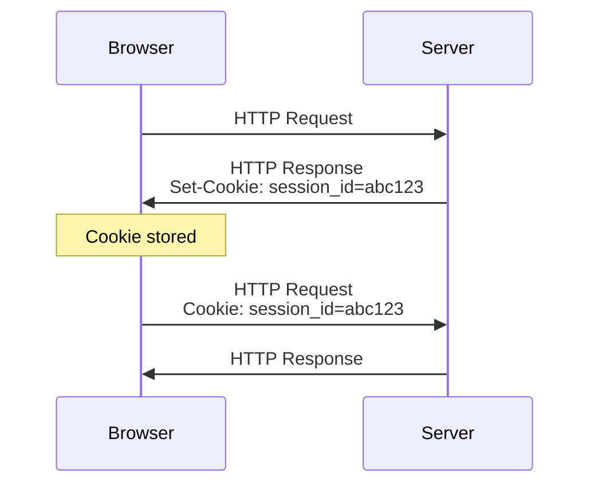
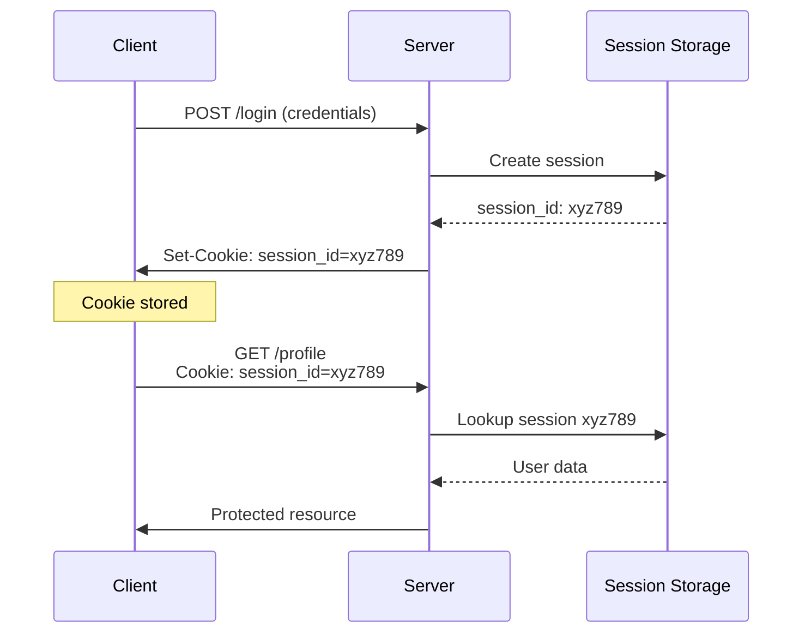
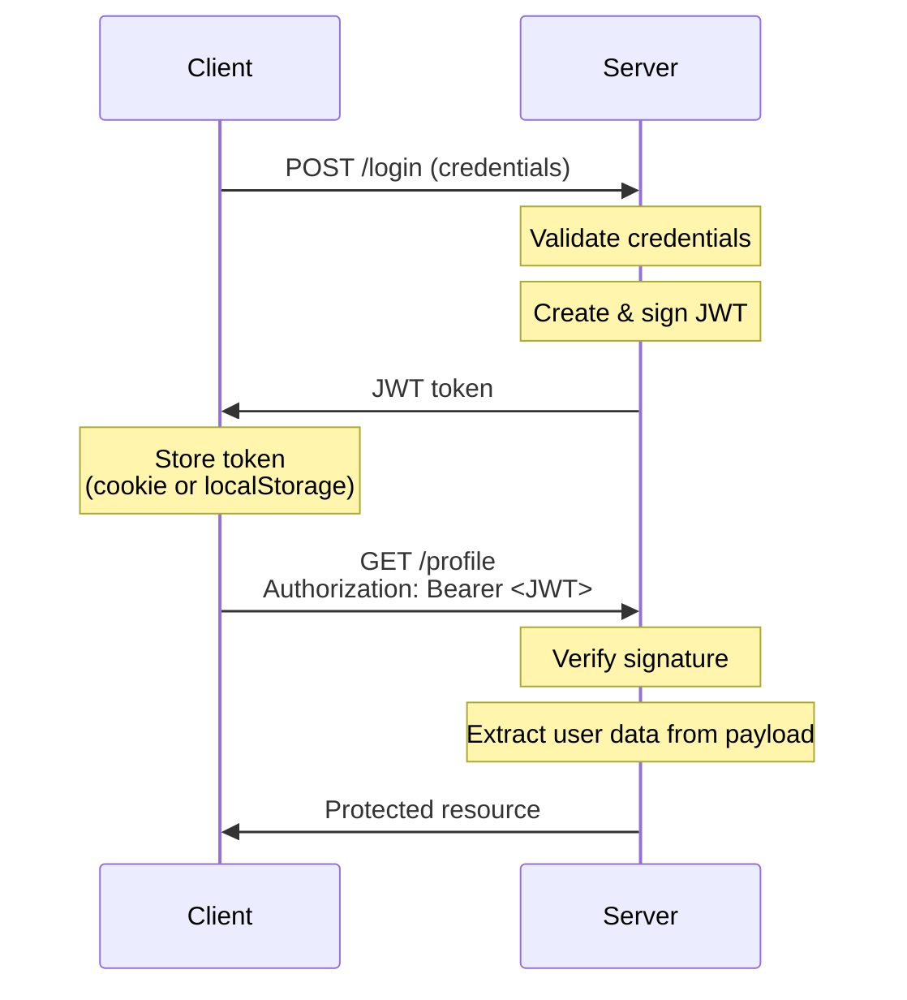
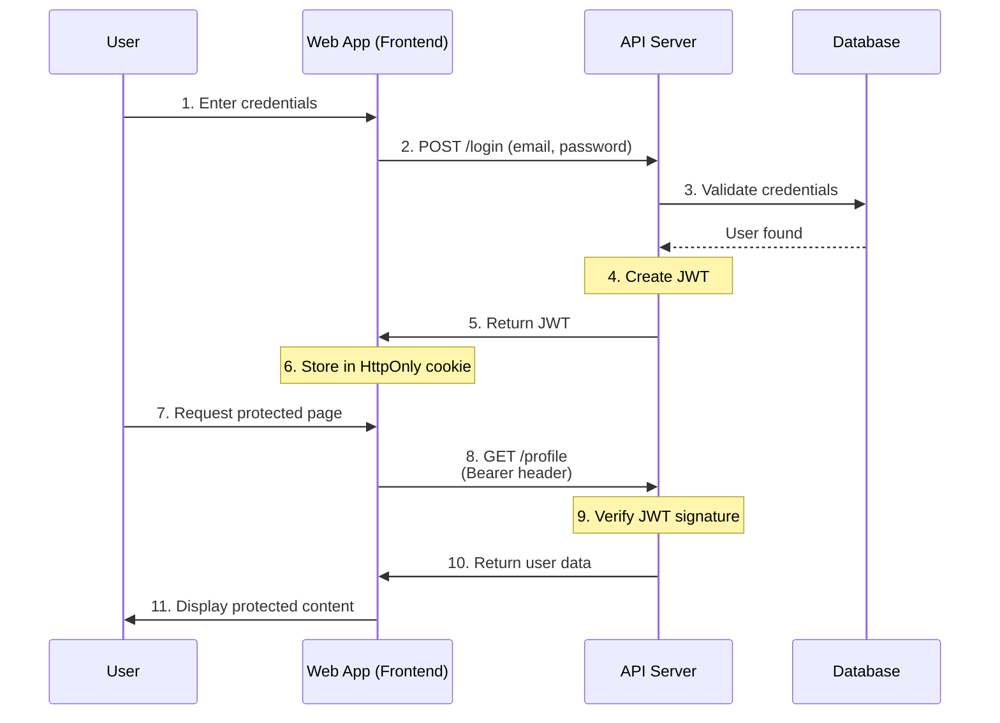

# Authentication Methods for Web Applications

## Securing User Access in Modern Web Apps

---
layout: default
---

# What is Authentication?

**Authentication** is the process of verifying the identity of a user or system.

**Purpose:**

- ✅ Verify user identity
- ✅ Secure access to protected resources
- ✅ Maintain user sessions
- ✅ Control permissions and authorization

**Key Question:** _"Are you who you claim to be?"_

---
layout: center
---

# Cookies

## The Foundation of Web Authentication

---

# What are Cookies?

<v-clicks>

**Cookies** are small pieces of data stored by the browser and automatically sent with each request to the same domain.

**Key Characteristics:**

- Stored in the browser
- Automatically included in HTTP requests
- Domain-specific
- Can have expiration dates

**Typical Size:** Up to 4KB per cookie

</v-clicks>

---

# Cookie Flow



---
layout: two-cols-header
---

# Cookies: Pros

## ✅ Advantages

::left::

- **Built-in browser mechanism**
  - No custom code needed
  - Automatic handling

- **Works seamlessly**
  - Sent with same-origin requests
  - Standard HTTP feature

::right::

- **Security options**
  - HttpOnly flag prevents XSS access
  - Secure flag for HTTPS only

---
layout: two-cols-header
---

# Cookies: Cons

## ⚠️ Disadvantages

::left::

- **Configuration complexity**
  - Easy to misconfigure
  - Security vulnerabilities if not set correctly

- **Security concerns**
  - Vulnerable to XSS attacks
  - Needs CSRF protection

::right::

- **Size limitations**
  - Limited to ~4KB per cookie

---
layout: center
---

# Sessions

## Server-Side State Management

---

# What are Sessions?

**Sessions** are a server-side method of keeping users logged in by maintaining state on the server.

**Basic Workflow:**

1. 🔐 User logs in with credentials
2. 🎫 Server creates a session and stores user data
3. 📝 Server generates a unique session ID
4. 🍪 Session ID sent to client in a cookie
5. 🔄 Client sends session ID with each request
6. ✅ Server validates session ID and retrieves user data

---

# Session Flow



---

# Server Session Storage Options

| Storage Type      | Speed        | Persistence        | Scalability            |
| ----------------- | ------------ | ------------------ | ---------------------- |
| **In-Memory**     | ⚡ Very Fast | ❌ Lost on restart | ⚠️ Single server       |
| **Database**      | 🐢 Slower    | ✅ Persistent      | ✅ Highly scalable     |
| **Cache (Redis)** | ⚡ Very Fast | ⚠️ Volatile        | ✅ Distributed systems |
| **File System**   | 🐢 Slow      | ✅ Persistent      | ❌ Not scalable        |

---

# Session Storage: In-Memory

```javascript
// Example: Express session in memory
const sessions = {};
sessions["xyz789"] = { userId: 123, loginTime: Date.now() };
```

**Characteristics:**

- ✅ Fast access
- ❌ Lost on server restart
- ❌ Not scalable across multiple servers

**Best for:** Development, small apps

---

# Session Storage: Database

```javascript
// Store session in PostgreSQL
INSERT INTO sessions (id, user_id, data, expires_at)
VALUES ('xyz789', 123, '{"cart": [...]}', '2025-10-12');
```

**Characteristics:**

- ✅ Persistent and reliable
- ✅ Scalable
- ❌ Slower than memory
- ❌ Higher database load

---

# Session Storage: Cache (Redis)

```javascript
// Store session in Redis
await redis.set(
  "session:xyz789",
  JSON.stringify({
    userId: 123,
    loginTime: Date.now(),
  }),
  "EX",
  3600,
); // Expires in 1 hour
```

**Characteristics:**

- ✅ Very fast
- ✅ Good for distributed systems
- ✅ Built-in expiration
- ⚠️ Data lost if cache resets

**Best for:** Production, scalable apps

---

# Session Storage: File System

```javascript
// Store session in file
fs.writeFileSync("/sessions/xyz789.json", sessionData);
```

**Characteristics:**

- ✅ Simple setup
- ❌ Not scalable
- ❌ Requires manual cleanup

---

# Session Security: ID Generation

**🔒 Best Practices:**

- Use cryptographically secure random values
- Make IDs long and unpredictable
- Never use sequential or predictable IDs

```javascript
// Good: Cryptographically secure
const sessionId = crypto.randomBytes(32).toString("hex");

// Bad: Predictable
const sessionId = Date.now().toString();
```

---

# Session Security: Validation

**✅ Best Practices:**

- Validate session ID on every request
- Check expiration time
- Verify session integrity
- Implement session timeout

---
layout: two-cols-header
---

# Sessions: Pros

## ✅ Advantages

::left::

- **Easy session management**
  - Simple to revoke access
  - Instant logout capability

- **Server control**
  - Full control over sessions
  - Can track active users

::right::

- **Familiar pattern**
  - Well-understood by developers
  - Simple for traditional web apps

---
layout: two-cols-header
---

# Sessions: Cons

## ⚠️ Disadvantages

::left::

- **Server storage required**
  - Memory or database overhead
  - Storage costs scale with users

- **Horizontal scaling challenges**
  - Requires shared storage
  - Session synchronization needed

::right::

- **Stateful architecture**
  - Server must maintain state
  - Complicates microservices

---
layout: center
---

# JWT (JSON Web Tokens)

## Stateless Authentication

---

# What are JWTs?

**JWT** is a self-contained token with a signature, eliminating the need for server-side session storage.

**Structure:** `header.payload.signature`

```
eyJhbGciOiJIUzI1NiIsInR5cCI6IkpXVCJ9.
eyJ1c2VySWQiOjEyMywiZW1haWwiOiJ1c2VyQGV4YW1wbGUuY29tIiwiZXhwIjoxNjk3MDAwMDAwfQ.
SflKxwRJSMeKKF2QT4fwpMeJf36POk6yJV_adQssw5c
```

**Components:**

1. **Header**: Algorithm and token type
2. **Payload**: Claims (user data, expiration, etc.)
3. **Signature**: Cryptographic signature to verify authenticity

---

# JWT Structure: Header

```json
{
  "alg": "HS256", // Signing algorithm
  "typ": "JWT" // Token type
}
```

**Purpose:** Specifies the algorithm used to sign the token

---

# JWT Structure: Payload

```json
{
  "userId": 123,
  "email": "user@example.com",
  "role": "admin",
  "exp": 1697000000, // Expiration time
  "iat": 1696999000 // Issued at time
}
```

**Purpose:** Contains the claims (user data and metadata)

---

# JWT Structure: Signature

```
HMACSHA256(
  base64UrlEncode(header) + "." + base64UrlEncode(payload),
  secret_key
)
```

**Purpose:** Ensures the token hasn't been tampered with

---

# JWT Flow



---

# How JWT Works: Login & Token Creation

**1. User logs in**

```javascript
POST /api/login
{ "email": "user@example.com", "password": "secret123" }
```

**2. Server creates and signs JWT**

```javascript
const token = jwt.sign({ userId: 123, email: "user@example.com" }, SECRET_KEY, {
  expiresIn: "1h",
});
```

**3. Client stores token**

```javascript
// In cookie or localStorage
localStorage.setItem("token", token);
```

---

# How JWT Works: Using the Token

**4. Client sends token with each request**

```javascript
fetch("/api/profile", {
  headers: {
    Authorization: `Bearer ${token}`,
  },
});
```

**5. Server verifies signature**

```javascript
const decoded = jwt.verify(token, SECRET_KEY);
// If valid: { userId: 123, email: "user@example.com", ... }
// If invalid: throws error
```

**Key benefit:** No database lookup needed!

---
layout: two-cols-header
---

# JWT: Pros

## ✅ Advantages

::left::

- **Stateless & scalable**
  - No server-side storage needed
  - Easy horizontal scaling

- **Cross-domain friendly**
  - Works well with APIs
  - Microservices-ready

::right::

- **Self-contained**
  - User data in token
  - No database lookup per request

- **Mobile-friendly**
  - Easy to use in mobile apps

---

---
layout: two-cols-header
---

- **Mobile-friendly**
  - Easy to use in mobile apps

---
layout: two-cols-header
---

# JWT: Cons

## ⚠️ Disadvantages

::left::

- **Hard to revoke**
  - Token valid until expiration
  - Requires blocklist for early revocation

- **Token size**
  - Larger than session IDs
  - More bandwidth usage

::right::

- **Storage security**
  - Must be stored securely
  - XSS vulnerable if in localStorage

- **No automatic logout**
  - Client controls token lifecycle

---
layout: center
---

# Storing & Sending Tokens

## Cookie vs Header

---

# Token Storage: Cookie-Based

```javascript
// Server sets cookie
res.cookie("token", jwt, {
  httpOnly: true, // Prevents JavaScript access
  secure: true, // HTTPS only
  sameSite: "strict", // CSRF protection
});
```

**Characteristics:**

- ✅ Automatically sent by browser
- ✅ HttpOnly flag prevents XSS
- ⚠️ Needs CSRF protection

**Best for:** Same-origin web applications

---

# Token Storage: Header-Based

```javascript
// Client sends token manually
fetch("/api/profile", {
  headers: {
    Authorization: `Bearer ${token}`,
  },
});
```

**Storage location:** localStorage or sessionStorage

**Characteristics:**

- ✅ Explicit control over token
- ✅ Works cross-origin
- ⚠️ Vulnerable to XSS if in localStorage

**Best for:** APIs, mobile apps, SPAs with different domains

---

# Cookie vs Header Comparison

| Aspect                | Cookie            | Header (Authorization) |
| --------------------- | ----------------- | ---------------------- |
| **Automatic sending** | ✅ Yes            | ❌ No (manual)         |
| **XSS protection**    | ✅ HttpOnly flag  | ⚠️ Depends on storage  |
| **CSRF protection**   | ⚠️ Needs SameSite | ✅ Not vulnerable      |
| **Cross-origin**      | ⚠️ Limited        | ✅ Easy                |
| **Mobile apps**       | ⚠️ Complex        | ✅ Simple              |

---

# Which Storage to Use?

**Recommendation:**

- 🌐 Same-origin web app → **Cookie** (with HttpOnly)
- 📱 Cross-origin or mobile → **Header** (Authorization Bearer)

---
layout: center
---

# Typical Web App Flow

## Putting It All Together

---

# Complete Authentication Flow



---

# Authentication Flow: Login Phase

**Steps 1-3: Login**

- User submits credentials to web app
- Web app forwards to API
- API validates against database

**Steps 4-6: Token Creation**

- API creates and signs JWT with user data
- JWT returned to web app
- Web app stores in HttpOnly cookie

---

# Authentication Flow: Request Phase

**Steps 7-11: Authenticated Requests**

- User requests protected resource
- Browser automatically sends cookie with JWT
- Web App sends a request to the API with a `Bearer ` header
- API verifies signature and returns data
- Web app displays content to user

---
layout: center
---

# Best Practices

## Security & Performance

---

# Security Best Practices: HTTPS & Token Lifetime

**🔒 Always use HTTPS**

- Encrypt all data in transit
- Prevents token/cookie interception
- Essential in production

**⏱️ Keep tokens short-lived**

- JWT expiration: 15 minutes to 1 hour
- Implement refresh tokens for longer sessions

---

# Security Best Practices: Storage & Secrets

**🚫 Never store sensitive data client-side**

- Don't store passwords or secrets
- Use HttpOnly cookies for tokens
- Avoid localStorage for sensitive tokens

**🔑 Use strong secrets for signing JWTs**

```javascript
// Bad: Weak secret
const secret = "secret123";

// Good: Strong random secret (at least 32 bytes)
const secret = process.env.JWT_SECRET; // Generated with crypto.randomBytes(64)
```

---

# Security Best Practices: Protection & Validation

**🛡️ Implement CSRF protection**

- Use SameSite cookie attribute
- Implement CSRF tokens for state-changing operations
- Verify origin headers

**✅ Validate everything**

- Validate user input
- Verify token signatures
- Check token expiration
- Validate session IDs

---

# Security Best Practices: Refresh Tokens

**🔄 Implement refresh tokens**

```javascript
// Short-lived access token (15 min)
const accessToken = jwt.sign(payload, SECRET, { expiresIn: "15m" });

// Long-lived refresh token (7 days)
const refreshToken = jwt.sign(payload, REFRESH_SECRET, { expiresIn: "7d" });
```

**Benefits:** Better security with short-lived tokens

---

# Security Best Practices: Monitoring

**📝 Log authentication events**

- Log login attempts (success and failure)
- Track suspicious activities
- Monitor for brute force attacks

**⚡ Rate limiting**

- Limit login attempts per IP
- Prevent brute force attacks
  - Use exponential backoff

---
layout: center
---

# Summary

## Key Takeaways---

# Summary: Authentication Methods

| Method       | Description                                | Best For                           |
| ------------ | ------------------------------------------ | ---------------------------------- |
| **Sessions** | Server remembers users via session storage | Traditional web apps, admin panels |
| **JWT**      | Client proves identity with signed data    | APIs, microservices, SPAs          |
| **Cookies**  | Storage and transport method for both      | Same-origin web applications       |

---

# Summary: Session Storage Trade-offs

**Speed:**

- In-memory > Cache > Database > File system

**Persistence:**

- Database > File > Cache > In-memory

**Scalability:**

- Cache ≈ Database > In-memory > File system

---

# Recommended Approach

**For most modern web applications:**

```
✅ Use Cookies + JWT
```

**Why this combination?**

- ✅ **Scalable**: JWT is stateless
- ✅ **Secure**: HttpOnly cookies prevent XSS
- ✅ **Simple**: Automatic cookie handling
- ✅ **Flexible**: Works with microservices

---

# Implementation Guidelines

**Architecture:**

- Store JWT in HttpOnly, Secure, SameSite cookie
- Keep tokens short-lived (15-60 minutes)
- Implement refresh token mechanism
- Always use HTTPS in production

---
layout: two-cols-header
---

# When to Use Sessions

**Choose Sessions for:**

::left::

- 🏢 Traditional monolithic app
- 🔒 Need instant logout/revocation
- 📊 Tracking active sessions is important

::right::

- 🗄️ Server-side state is acceptable
- 👥 Smaller user base

---
layout: two-cols-header
---

# When to Use JWT

**Choose JWT for:**

::left::

- 🌐 Building APIs or microservices
- 📱 Supporting mobile apps
- ⚡ Need horizontal scalability

::right::

- 🔄 Cross-origin requests
- 🚀 Stateless architecture preferred
- 👥 Large user base

---
layout: end
---

# Questions?

Thank you
